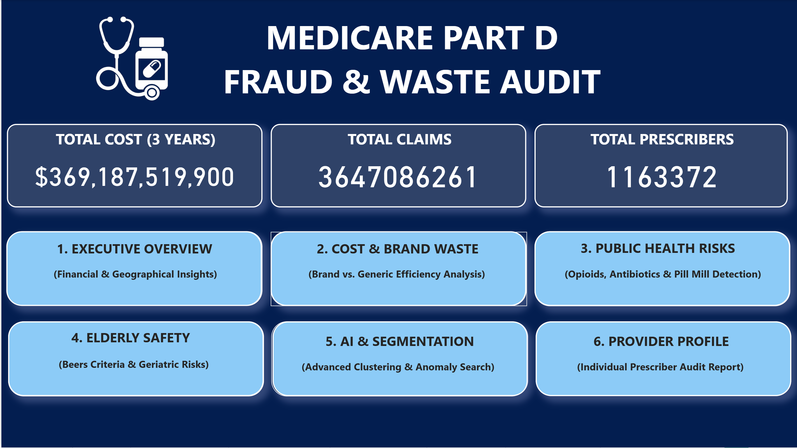
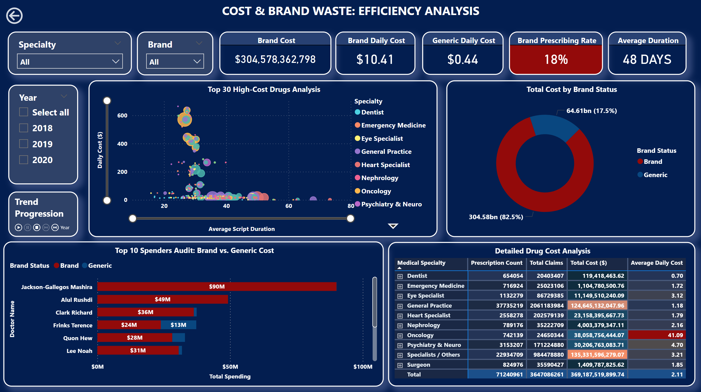
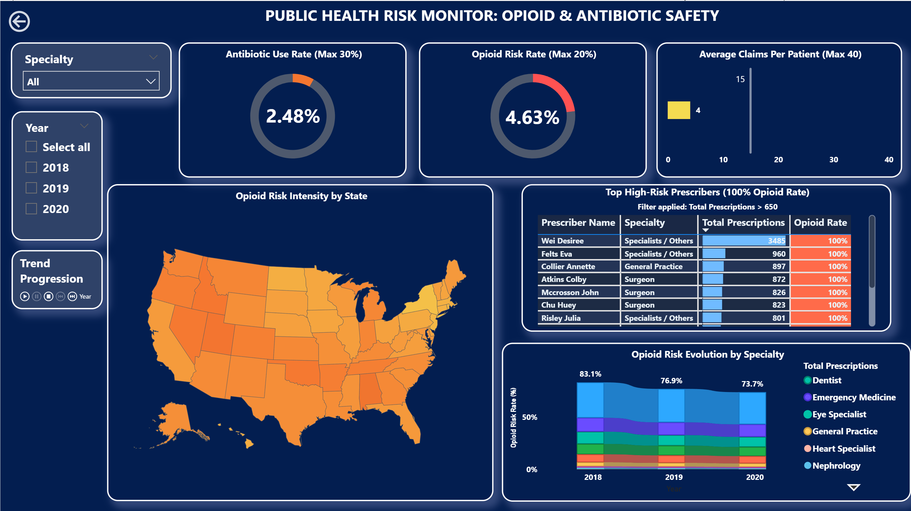
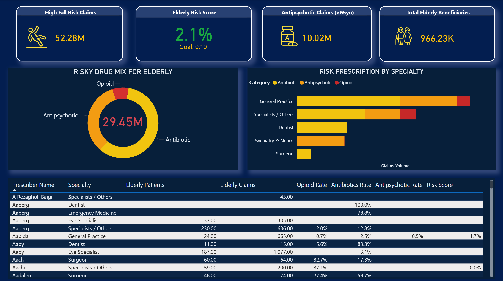
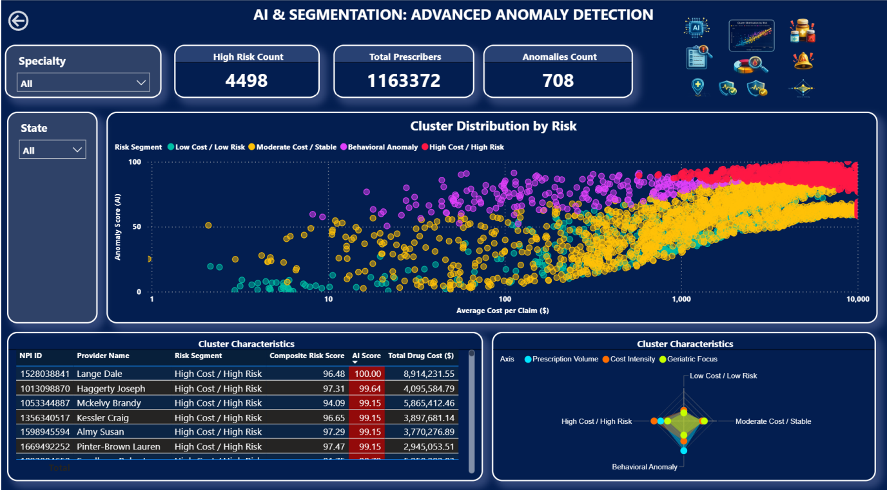

# Healthcare Fraud Analytics Dashboard

## Description
A comprehensive Medicare Part D fraud and waste analysis project using AI to detect high-risk prescribers through clustering and anomaly detection techniques.

## Technologies Used
- **Python**: Data processing and AI models
- **Power BI**: Interactive visualization dashboard
- **Machine Learning**: 
  - K-Means Clustering
  - Isolation Forest

## Processing Pipeline
1. **Load & Aggregate**: Aggregate data from 3 years (2018-2020) by Prescriber NPI
2. **Feature Engineering**: Calculate 5 features reflecting prescribing behavior
3. **AI Models**: 
   - K-Means clustering (4 groups)
   - Isolation Forest (anomaly detection)
4. **Risk Scoring**: Calculate composite risk score

## Key Results
- **Total Prescribers**: 1,163,372
- **High Risk Count**: 4,498 (0.4%)
- **Red Zone Prescribers**: 3,712 (0.32%) - accounting for 4.36% of total cost

## Dashboard Overview

The `Final.pbix` file contains a comprehensive Power BI dashboard with 7 pages:

### 1. Executive Overview

### 2. Executive Overview: Financial & Geographical Insights

### 3. Cost & Brand Waste: Efficiency Analysis

### 4. Public Health Risk Monitor: Opioid & Antibiotic Safety

### 5. Elderly Safety Monitor

### 6. AI & Segmentation: Advanced Anomaly Detection

- Cluster distribution by risk (scatter plot)
  - X-axis: Average Cost per Claim ($) - Log scale
  - Y-axis: Anomaly Score - 0 to 100
  - 4 clusters: Low Cost/Low Risk, Moderate/Stable, Behavioral Anomaly, High Cost/High Risk
- Cluster characteristics (radar chart)
- Top risk anomalies table with detailed prescriber information

### 7. Provider Search & Profile: Digital Dossier

## License
This project is for educational and research purposes.
